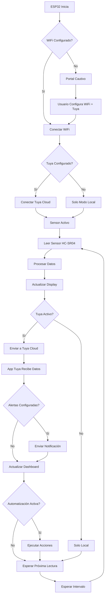
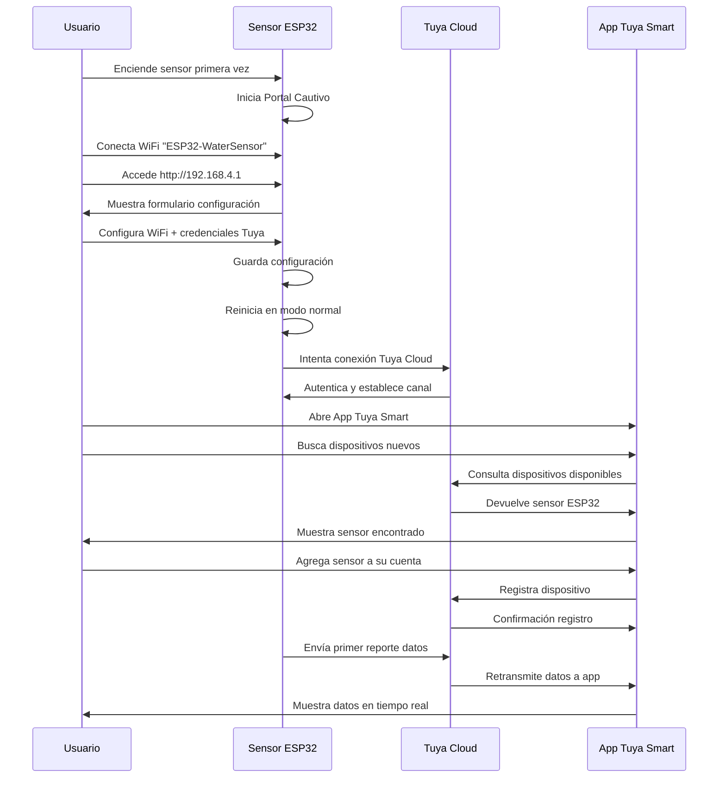

# 📱 MANUAL DE USUARIO TUYA IoT - SENSOR DE NIVEL DE AGUA
*Guía completa para configuración y uso con Tuya Smart/Smart Life*

---

## 🎯 INTRODUCCIÓN

Este manual te guía paso a paso para integrar tu **Sensor de Nivel de Agua ESP32** con el ecosistema **Tuya IoT Cloud**, permitiéndote:

- 📱 **Monitorear** el nivel de agua desde tu smartphone
- 🔔 **Recibir notificaciones** automáticas cuando el tanque se llene o vacíe
- 🏠 **Automatizar** dispositivos según el nivel del agua
- 📊 **Ver historial** de niveles y consumo de agua
- 🌐 **Control remoto** desde cualquier lugar del mundo

---

## 📋 REQUISITOS PREVIOS

### **Hardware Necesario:**
- ✅ Sensor ESP32 (Heltec WiFi Kit 32 recomendado)
- ✅ Sensor HC-SR04 ultrasónico
- ✅ Conexión WiFi estable
- ✅ Smartphone Android/iOS

### **Apps Necesarias:**
- 📱 **Tuya Smart** (recomendada) o **Smart Life**
- 🌐 Navegador web para configuración inicial

### **Cuentas Requeridas:**
- 📧 Cuenta Tuya Smart (gratuita)
- 🔑 Desarrollador Tuya IoT (gratuita)

---

## 🚀 CONFIGURACIÓN INICIAL DEL SENSOR

### **FASE 1: Primer Arranque del Sensor**

#### **1.1 Encendido Inicial**
```
⚡ Conectar alimentación al ESP32
🔵 LED azul parpadeando = Modo configuración
🖥️ Display OLED muestra: "PORTAL CAUTIVO"
```

#### **1.2 Conexión al Portal Cautivo**
1. **Buscar red WiFi:** `ESP32-WaterSensor-XXXX`
2. **Conectar** con contraseña: `12345678`
3. **Abrir navegador** → `http://192.168.4.1`
4. **Portal cautivo** se abre automáticamente

#### **1.3 Configuración Básica en Portal**
```markdown
📋 COMPLETAR FORMULARIO:
   🌐 WiFi SSID: [Tu red WiFi]
   🔑 Contraseña WiFi: [Tu contraseña]
   🏷️ Nombre dispositivo: "Sensor Tanque Agua"
   📍 Ubicación: "Azotea" / "Jardín" / etc.
```

---

### **FASE 2: Configuración Tuya IoT**

#### **2.1 Registro en Tuya Developer**
1. **Ir a:** https://iot.tuya.com/
2. **Crear cuenta** gratuita de desarrollador
3. **Verificar email** y completar perfil
4. **Acceder al dashboard** de desarrollador

#### **2.2 Crear Proyecto IoT**
```markdown
🏗️ NUEVO PROYECTO:
   📛 Nombre: "Sensor Nivel Agua Casa"
   📊 Tipo: Smart Home
   🌍 Región: Tu país/región  
   🔧 Protocolo: WiFi + Cloud
```

#### **2.3 Obtener Credenciales**
```markdown
📋 ANOTAR DATOS IMPORTANTES:
   🔑 Product ID (PID): dp-XXXXXXXXXX
   🛡️ Device Secret: XXXXXXXXXXXXXXXX
   🌐 Device ID: XXXXXXXXXXXXXXXXXXXX
```

#### **2.4 Configurar Credenciales en Sensor**
1. **Acceder portal cautivo** del sensor
2. **Ir a sección "Configuración Tuya"**
3. **Introducir credenciales:**
   ```
   📋 FORMULARIO TUYA:
      🔑 Product ID: [dp-XXXXXXXXXX]
      🛡️ Device Secret: [Tu Device Secret]
      🌐 Device ID: [Tu Device ID]
      ✅ Habilitar Tuya: ☑️ Activado
   ```
4. **Guardar configuración**

---

## 📱 CONFIGURACIÓN EN APP MÓVIL

### **FASE 3: Instalación y Configuración App**

#### **3.1 Instalación App Tuya Smart**
1. **Descargar** desde App Store/Google Play: `Tuya Smart`
2. **Crear cuenta** o **iniciar sesión**
3. **Permitir permisos** de ubicación y notificaciones

#### **3.2 Agregar Dispositivo**
```markdown
📱 EN LA APP TUYA SMART:
   ➕ Presionar "+" (Agregar dispositivo)
   🏠 Categoría: "Sensores" → "Sensor de Agua"
   📡 Método: "Emparejamiento WiFi"
   🔍 Buscar dispositivos cercanos
```

#### **3.3 Proceso de Emparejamiento**
1. **Asegurar** que el sensor está en modo configuración
2. **App detecta** el sensor automáticamente
3. **Confirmar conexión** WiFi
4. **Esperar sincronización** (30-60 segundos)
5. **Verificar conexión** exitosa

#### **3.4 Configuración del Dispositivo en App**
```markdown
⚙️ CONFIGURAR EN APP:
   🏷️ Nombre: "Tanque Azotea"
   📍 Ubicación: Seleccionar habitación
   🔔 Notificaciones: Activar todas
   📊 Umbrales: Configurar alertas
```

---

## 📊 DATOS QUE ENVÍA EL SENSOR A TUYA

### **4.1 Parámetros Principales**
| **Parámetro** | **Tipo** | **Descripción** | **Rango** |
|---------------|----------|-----------------|-----------|
| `water_level` | Float | Nivel de agua en litros | 0.0 - 100.0L |
| `distance` | Float | Distancia sensor-agua (cm) | 5.0 - 200.0cm |
| `percentage` | Integer | Porcentaje de llenado | 0 - 100% |
| `filling_status` | Boolean | ¿Se está llenando? | true/false |
| `alert_level` | String | Nivel de alerta | "OK"/"LOW"/"FULL" |
| `wifi_signal` | Integer | Señal WiFi (dBm) | -100 - 0 |
| `uptime` | Integer | Tiempo encendido (minutos) | 0 - ∞ |

### **4.2 Frecuencia de Envío**
```markdown
📡 INTERVALOS DE REPORTE:
   ⏱️ Normal: Cada 30 segundos
   🚰 Llenando: Cada 5 segundos  
   ⚠️ Alerta: Inmediato
   📊 Historial: Cada 5 minutos
```

### **4.3 Formato de Datos JSON**
```json
{
  "timestamp": "2024-09-27T14:30:00Z",
  "device_id": "esp32_water_sensor_001",
  "data": {
    "water_level": 45.6,
    "distance": 34.2,
    "percentage": 78,
    "filling_status": true,
    "alert_level": "OK",
    "wifi_signal": -45,
    "temperature": 24.5,
    "uptime": 1440
  }
}
```

---

## 🔔 CONFIGURACIÓN DE NOTIFICACIONES

### **5.1 Tipos de Alertas Disponibles**
```markdown
🚨 ALERTAS CONFIGURABLES:
   💧 Tanque Lleno (95-100%)
   ⚠️ Nivel Bajo (0-10%)
   🚰 Llenado Iniciado
   ⏹️ Llenado Completado
   📶 Pérdida Conexión WiFi
   🔋 Batería Baja (si aplica)
```

### **5.2 Configurar Notificaciones**
1. **Abrir app** Tuya Smart
2. **Seleccionar dispositivo** sensor
3. **Ir a "Configuración"** ⚙️
4. **Tocar "Notificaciones"** 🔔
5. **Activar alertas** deseadas:
   ```
   ✅ Tanque lleno: Activado
   ✅ Nivel bajo: Activado  
   ✅ Llenado iniciado: Activado
   ❌ Conexión perdida: Desactivado
   ```

### **5.3 Personalizar Umbrales**
```markdown
🎯 CONFIGURAR LÍMITES:
   📈 Alerta "Lleno": 95% (ajustable 90-100%)
   📉 Alerta "Bajo": 10% (ajustable 5-20%)
   ⏰ Horarios silenciosos: 23:00 - 07:00
   📱 Tipos notificación: Push + SMS + Email
```

---

## 🏠 AUTOMATIZACIONES CON TUYA SMART

### **6.1 Automatización Básica: Control de Bomba**

#### **Escenario:** Llenar tanque automáticamente
```markdown
🔧 CREAR AUTOMATIZACIÓN:
   📋 Nombre: "Llenar Tanque Automático"
   🎯 Disparador: Nivel agua < 20%
   ⚡ Acción: Encender bomba de agua
   ⏹️ Condición parada: Nivel agua > 90%
```

#### **Configuración paso a paso:**
1. **App Tuya Smart** → **"Automatización"** → **"+"**
2. **Elegir condición:**
   ```
   📊 CUANDO: Sensor Nivel Agua
   📉 Condición: Porcentaje < 20%
   ⏰ Y horario: Entre 06:00 - 22:00
   ```
3. **Configurar acción:**
   ```
   ⚡ ENTONCES: Bomba de Agua
   🔛 Acción: Encender
   ⏱️ Durante: Hasta nueva condición
   ```
4. **Condición de parada:**
   ```
   🛑 DETENER CUANDO: Sensor Nivel Agua
   📈 Condición: Porcentaje > 90%
   ```

### **6.2 Automatización Avanzada: Sistema Inteligente**

#### **Escenario:** Casa inteligente completa
```markdown
🏠 AUTOMATIZACIÓN COMPLETA:
   🌅 Mañana (07:00): Verificar nivel y llenar si <30%
   🌞 Día: Monitoreo continuo
   🌆 Tarde (18:00): Llenar preventivo si <50%
   🌙 Noche (22:00): Solo alertas críticas
```

#### **Implementación:**
```yaml
Automatización 1 - "Llenado Matutino":
  Disparador: Horario 07:00 + Nivel < 30%
  Acción: Encender bomba 10 minutos
  
Automatización 2 - "Preventivo Vespertino":  
  Disparador: Horario 18:00 + Nivel < 50%
  Acción: Llenar hasta 80%
  
Automatización 3 - "Emergencia":
  Disparador: Nivel < 5% + Cualquier hora
  Acción: Notificación urgente + Encender bomba
```

### **6.3 Integración con Otros Dispositivos**

#### **Ejemplo 1: Ahorro de Energía**
```markdown
💡 AUTOMATIZACIÓN INTELIGENTE:
   🎯 SI tanque lleno (>95%)
   ⚡ ENTONCES apagar luces jardín
   💰 AHORRO: Señal visual "tanque lleno"
```

#### **Ejemplo 2: Sistema de Riego**
```markdown
🌱 RIEGO AUTOMÁTICO:
   🎯 SI nivel agua > 60% Y horario 06:00
   💧 ENTONCES activar riego jardín 15 min
   🎯 SI nivel agua < 30%
   🚫 ENTONCES cancelar riego programado
```

#### **Ejemplo 3: Seguridad**
```markdown
🔒 ALERTA DE SEGURIDAD:
   🎯 SI nivel baja >20L en <5 minutos
   🚨 ENTONCES activar alarma (posible fuga)
   📱 Y enviar notificación urgente
```

---

## 📊 MONITOREO Y ANÁLISIS

### **7.1 Dashboard en Tiempo Real**
```markdown
📱 VISTA PRINCIPAL APP:
   💧 Nivel actual: 67.8L (89%)
   📏 Distancia: 12.4cm
   📈 Tendencia: ↗️ Llenando
   🕐 Última actualización: 14:32:15
   📶 Señal WiFi: -42dBm (Excelente)
```

### **7.2 Gráficos Históricos**
- **Día:** Nivel por horas (últimas 24h)
- **Semana:** Promedio diario
- **Mes:** Consumo total y patrones
- **Año:** Estadísticas anuales

### **7.3 Reportes de Consumo**
```markdown
📊 ESTADÍSTICAS MENSUALES:
   💧 Consumo total: 2,456L  
   📈 Pico máximo: 98L (12/09)
   📉 Mínimo registrado: 3L (27/09)
   🚰 Llenados totales: 23 veces
   ⏱️ Tiempo promedio llenado: 45 min
```

---

## ⚠️ SOLUCIÓN DE PROBLEMAS

### **8.1 Problemas Comunes**

#### **Sensor no aparece en App**
```markdown
🔍 VERIFICAR:
   📶 WiFi del sensor conectado
   📱 App y sensor en misma red WiFi
   🔑 Credenciales Tuya correctas
   🔄 Reiniciar sensor y re-emparejar
```

#### **Datos no se actualizan**
```markdown
🔍 VERIFICAR:
   📡 Conexión internet estable
   🌐 Servidor Tuya operativo
   ⚙️ Configuración intervalos sensor
   🔄 Reset configuración Tuya
```

#### **Notificaciones no llegan**
```markdown
🔍 VERIFICAR:
   🔔 Permisos notificación app
   📱 No molestar desactivado
   ⚙️ Configuración alertas sensor
   📶 Conexión móvil/WiFi estable
```

### **8.2 Comandos de Diagnóstico**

#### **En Portal Cautivo del Sensor:**
```markdown
🛠️ HERRAMIENTAS DIAGNÓSTICO:
   📊 Estado Tuya: Conectado/Desconectado
   🔄 Test conexión: Enviar datos prueba  
   📋 Logs Tuya: Ver últimos 50 eventos
   🔧 Reset Tuya: Limpiar configuración
```

#### **En App Tuya Smart:**
```markdown
🛠️ DIAGNÓSTICO APP:
   ⚙️ Configuración dispositivo → "Diagnóstico"
   📡 Test comunicación
   📊 Ver estadísticas conexión
   🔄 Sincronizar datos
```

---

## 🎯 CASOS DE USO REALES

### **9.1 Casa Familiar**
```markdown
🏡 FAMILIA GARCÍA - TANQUE 5,000L:
   📱 Monitoreo diario consumo familiar
   🚰 Llenado automático madrugada
   💰 Ahorro 30% factura agua
   🔔 Alertas nivel bajo padres
   📊 Control uso excesivo hijos
```

### **9.2 Negocio/Restaurante**
```markdown
🍽️ RESTAURANTE "EL BUEN SABOR":
   💧 Tanque 2,000L cocina industrial  
   ⏰ Llenado automático horarios específicos
   🚨 Alertas críticas encargado
   📊 Reportes consumo mensual
   💡 Integración sistema alarmas
```

### **9.3 Casa de Campo/Finca**
```markdown
🌾 FINCA "LOS NOGALES":
   💧 Múltiples tanques (casa + riego)
   📡 Monitoreo remoto desde ciudad
   🌱 Automatización riego cultivos
   ☀️ Integración panel solar
   📱 Alertas WhatsApp por SMS
```

### **9.4 Edificio de Apartamentos**
```markdown
🏢 EDIFICIO "VISTA HERMOSA":
   💧 Tanque principal 20,000L
   🏠 Administrador monitoreo central
   📊 Reportes consumo por apartamento
   💰 Facturación individual agua
   🔧 Mantenimiento preventivo
```

---

## 📚 FLUJO COMPLETO DEL SISTEMA

### **10.1 Diagrama de Flujo Operacional**



### **10.2 Flujo de Configuración Usuario**



---

## 🔐 SEGURIDAD Y PRIVACIDAD

### **11.1 Seguridad de Datos**
```markdown
🛡️ PROTECCIÓN IMPLEMENTADA:
   🔐 Encriptación TLS 1.2 Tuya Cloud
   🔑 Autenticación token único dispositivo
   📱 Datos almacenados localmente cifrados
   🌐 Comunicación HTTPS exclusivamente
   🔒 Sin almacenamiento credenciales plain text
```

### **11.2 Privacidad**
```markdown
🕵️ POLÍTICA PRIVACIDAD:
   📊 Datos enviados: Solo nivel agua y estado
   ❌ NO enviamos: Ubicación, audio, video
   🏠 Procesamiento: Local en dispositivo
   ☁️ Cloud: Solo datos telemetría agua
   🗑️ Retención: 30 días historial app
```

---

## 📞 SOPORTE Y CONTACTO

### **12.1 Recursos de Ayuda**
- 📖 **Manual Técnico:** `README.md` del proyecto
- 🐛 **Reportar Bugs:** GitHub Issues
- 💬 **Comunidad:** Discord/Telegram del proyecto
- 📧 **Soporte:** sensor.nivel.agua@gmail.com

### **12.2 Actualizaciones**
```markdown
🔄 SISTEMA AUTO-UPDATE:
   📦 Firmware OTA automático
   📱 App Tuya auto-actualiza
   ☁️ Tuya Cloud siempre actualizado
   🔔 Notificación nuevas versiones
```

---

## ✅ CHECKLIST CONFIGURACIÓN COMPLETA

### **13.1 Verificación Final**
```markdown
☑️ HARDWARE:
   ✅ ESP32 conectado y funcionando
   ✅ Sensor HC-SR04 midiendo correctamente
   ✅ Display OLED mostrando datos
   ✅ WiFi conectado estable

☑️ SOFTWARE:
   ✅ Portal cautivo configurado
   ✅ Credenciales Tuya introducidas
   ✅ Sensor reportando a Tuya Cloud
   ✅ App móvil recibiendo datos

☑️ FUNCIONALIDADES:
   ✅ Notificaciones activas
   ✅ Automatizaciones configuradas
   ✅ Historial datos funcionando
   ✅ Dashboard tiempo real operativo
```

---

**📅 Manual creado:** Septiembre 2024  
**🔄 Versión:** 3.0  
**✅ Estado:** Completo y funcional  

---

*¡Tu Sensor de Nivel de Agua con Tuya IoT está listo para usar! 🎉*