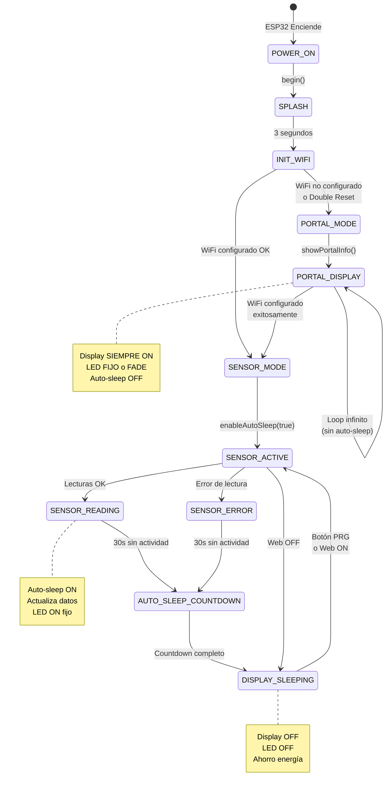
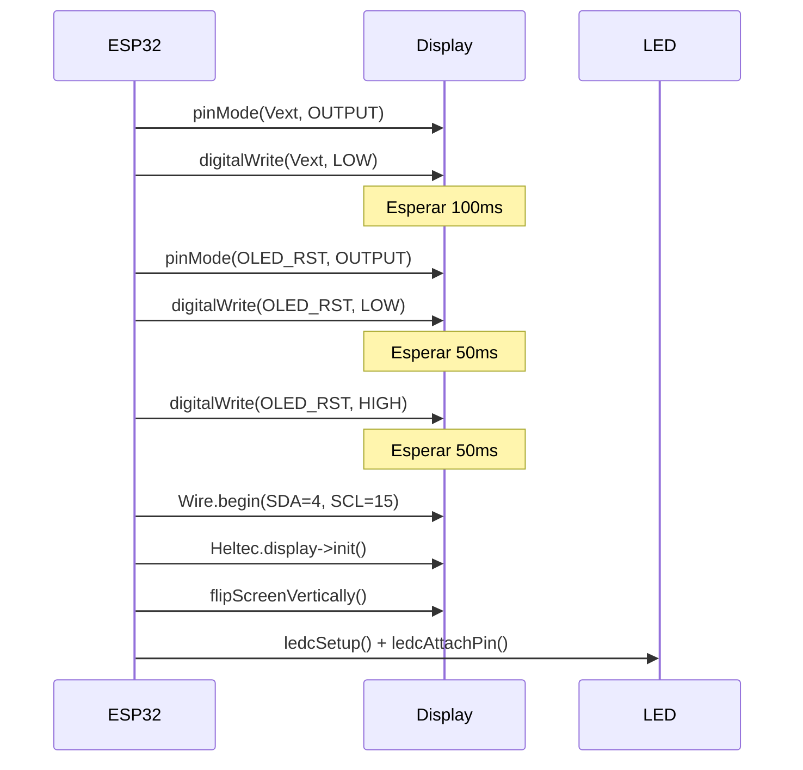
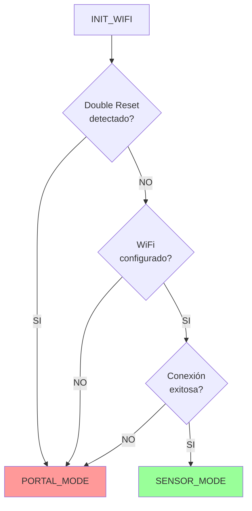
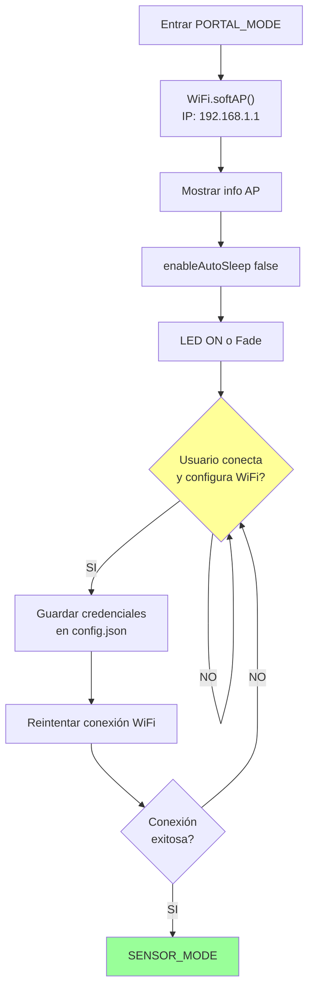
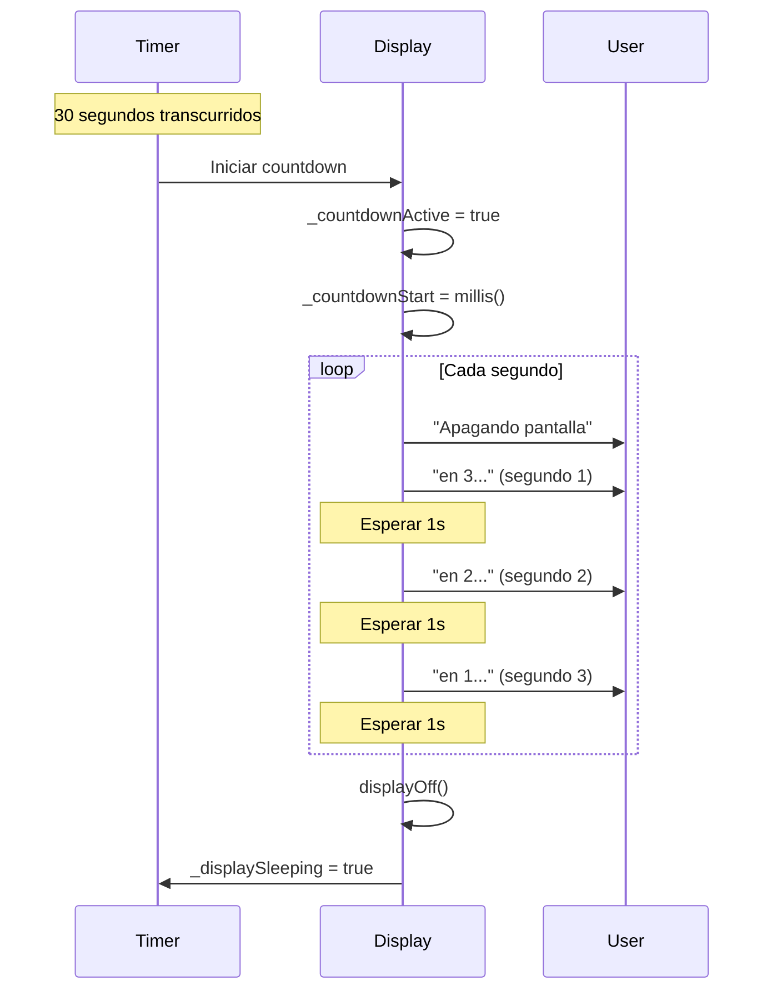
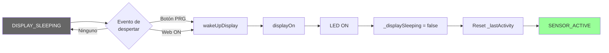
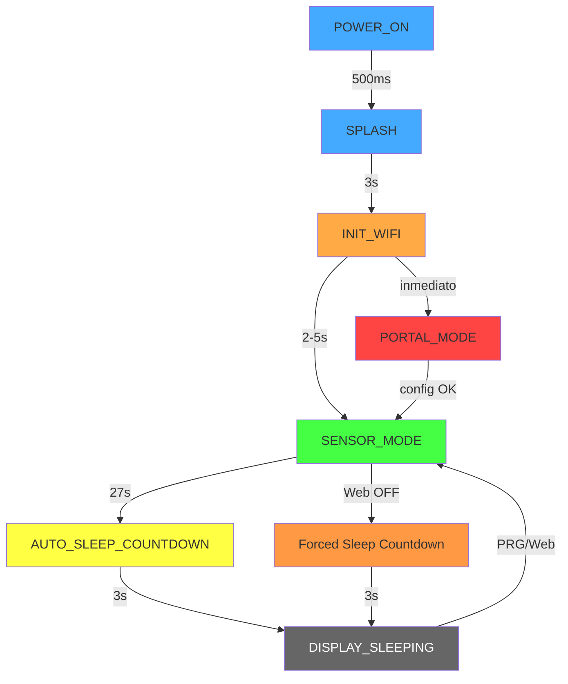
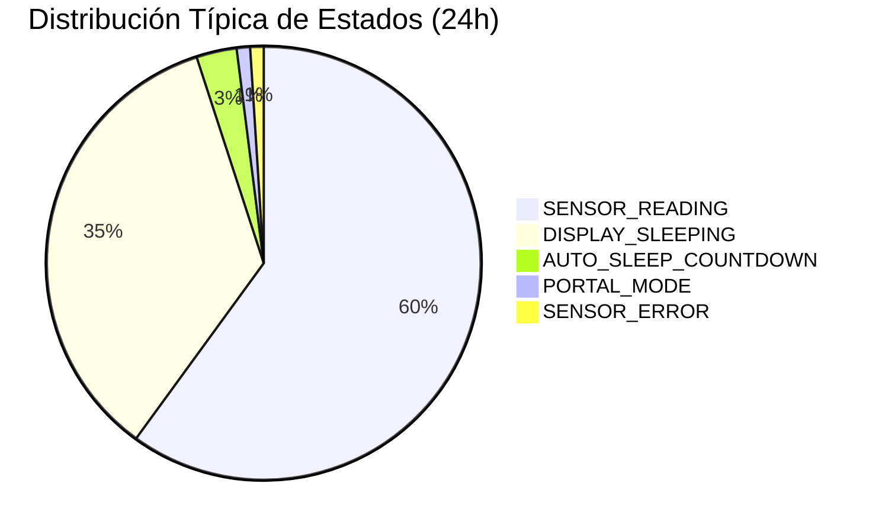

# 🔄 Máquina de Estados del Display OLED

## 📋 Contenido
1. [Diagrama General de Estados](#diagrama-general-de-estados)
2. [Estados Detallados](#estados-detallados)
3. [Transiciones](#transiciones)
4. [Casos Especiales](#casos-especiales)

---

## Diagrama General de Estados



---

## Estados Detallados

### 1. POWER_ON (Encendido)
**Duración**: ~500ms  
**Hardware**:
- Vext (GPIO 21) → LOW (encender OLED)
- OLED_RST (GPIO 16) → Toggle (reset display)
- I2C inicializado (SDA=4, SCL=15)

**Secuencia**:


### 2. SPLASH (Pantalla de Bienvenida)
**Duración**: 3 segundos exactos  
**Contenido**:
```
┌────────────────────┐
│   SENSOR NIVEL    │  ← Arial 16
│     DE AGUA       │  ← Arial 16
│                   │
│ v2.0 - DataTech   │  ← Arial 10
└────────────────────┘
```

**Código relevante**:
```cpp
void showSplashScreen() {
    display->clear();
    display->setFont(ArialMT_Plain_16);
    display->setTextAlignment(TEXT_ALIGN_CENTER);
    display->drawString(64, 10, "SENSOR NIVEL");
    display->drawString(64, 26, "DE AGUA");
    display->setFont(ArialMT_Plain_10);
    display->drawString(64, 45, "v2.0 - DataTech");
    display->display();
}
// En begin():
showSplashScreen();
delay(3000);  // ← Bloquea 3 segundos
```

### 3. INIT_WIFI (Inicializando WiFi)
**Duración**: Variable (depende de conexión)  
**Contenido**:
```
┌────────────────────┐
│  SENSOR DE        │  ← Arial 16
│  NIVEL DE AGUA    │  ← Arial 16
│                   │
│ Iniciando WiFi... │  ← Arial 10
└────────────────────┘
```

**Decisión de modo**:


### 4. PORTAL_MODE (Modo Portal Cautivo)
**Estado**: Persistente hasta configuración exitosa  
**Auto-sleep**: ❌ DESHABILITADO  
**LED**: Encendido fijo o fade (según preferencia)

**Contenido del display**:
```
┌──────────────────────────────────────────────┐
│ PORTAL CAUTIVO                              │  ← Arial 10
│ Red: ESP32: Sensor de nivel de agua        │
│ Contraseña: 12345678                        │
│ IP: 192.168.1.1                             │
│                                             │
│ MAC: XX:XX:XX:XX:XX:XX                      │
│ Clientes: 0                                 │  ← Dinámico
└──────────────────────────────────────────────┘
```

**Notas importantes**:
- **SSID**: `"ESP32: Sensor de nivel de agua"` (configurable en JSON)
- **IP**: `192.168.1.1` (configurada con `WiFi.softAPConfig()`)
- **Password**: Configurable (default: "12345678")
- **Portal Cautivo**: DNS server redirige todas las peticiones a 192.168.1.1
- **Double Reset**: Si se detecta, carga último WiFi del JSON y reintenta conexión
- **Clientes conectados**: Muestra número de clientes actualmente conectados al AP

**Diagrama de flujo**:


### 5. SENSOR_MODE (Modo Sensor Activo)
**Auto-sleep**: ✅ HABILITADO (30 segundos default)  
**LED**: Encendido fijo (255 PWM)

**Sub-estados**:

#### 5.1 SENSOR_READING (Lectura Normal)
**Contenido**:
```
┌──────────────────────────┐
│ SENSOR DE NIVEL         │  ← Arial 10 (título)
│ Dist: 45.2 cm           │
│ Agua: 125.8 L           │
│ Lleno: 75%              │
│                         │
│ WiFi: MiSSID            │  ← (o "Sin WiFi")
└──────────────────────────┘
```

**Condiciones**:
- ✅ Sensor respondiendo
- ✅ Distancia < 400cm
- ✅ JSON válido

#### 5.2 SENSOR_ERROR (Error de Lectura)
**Contenido**:
```
┌──────────────────────────┐
│ SENSOR DE NIVEL         │
│ ⚠️ SENSOR ERROR         │
│ Verificar conexión      │
│ Trig/Echo pins          │
│                         │
│ WiFi: MiSSID            │
└──────────────────────────┘
```

**Condiciones**:
- ❌ Sensor no responde
- ❌ Distancia >= 400cm
- ❌ Timeout de lectura

### 6. AUTO_SLEEP_COUNTDOWN (Countdown de Apagado)
**Duración**: 3 segundos  
**Trigger**: 30 segundos sin actividad (configurable)

**Animación**:


**Pantalla durante countdown**:
```
┌──────────────────────────┐
│                         │
│  Apagando pantalla      │  ← Arial 16
│                         │
│    en 2...              │  ← Arial 16
│                         │
└──────────────────────────┘
```

**Código**:
```cpp
void checkAutoSleep() {
    if (!_autoSleepEnabled || _displaySleeping) return;
    
    unsigned long timeSinceActivity = millis() - _lastActivity;
    
    if (_countdownActive) {
        unsigned long elapsed = (millis() - _countdownStart) / 1000;
        int remaining = 3 - elapsed;
        
        if (remaining != _countdownSeconds) {
            _countdownSeconds = remaining;
            
            if (_countdownSeconds > 0) {
                // Mostrar countdown
                display->clear();
                display->setFont(ArialMT_Plain_16);
                display->setTextAlignment(TEXT_ALIGN_CENTER);
                display->drawString(64, 15, "Apagando pantalla");
                display->drawString(64, 35, "en " + String(_countdownSeconds) + "...");
                display->display();
            } else {
                // Apagar
                displayOff();
                _displaySleeping = true;
            }
        }
    } else {
        // Verificar si es momento de countdown
        if (timeSinceActivity >= (_autoSleepTime - 3) * 1000) {
            _countdownActive = true;
            _countdownStart = millis();
            _countdownSeconds = 3;
        }
    }
}
```

### 7. DISPLAY_SLEEPING (Pantalla Dormida)
**Estado**: Bajo consumo  
**Display**: OFF (completamente negro)  
**LED**: OFF (0 PWM)  
**Consumo**: ~5mA (vs ~50mA encendido)

**Salida del estado**:


**Botón PRG - Detección**:
```cpp
void handlePRGButton() {
    bool current = digitalRead(PRG_BUTTON_PIN);
    unsigned long now = millis();
    
    // Flanco descendente con debounce
    if (current == LOW && _lastButtonState == HIGH && 
        (now - _lastButtonPress > 200)) {
        
        _lastButtonPress = now;
        
        if (_displaySleeping) {
            wakeUpDisplay();  // Solo si está dormido
        }
    }
    
    _lastButtonState = current;
}
```

---

## Transiciones

### Tabla de Transiciones

| Estado Origen | Evento | Estado Destino | Tiempo |
|---------------|--------|----------------|--------|
| POWER_ON | `begin()` | SPLASH | 500ms |
| SPLASH | Timer 3s | INIT_WIFI | 3s |
| INIT_WIFI | Double reset | PORTAL_MODE | inmediato |
| INIT_WIFI | WiFi OK | SENSOR_MODE | ~2-5s |
| PORTAL_MODE | Config exitosa | SENSOR_MODE | inmediato |
| SENSOR_ACTIVE | 27s inactividad | AUTO_SLEEP_COUNTDOWN | 27s |
| AUTO_SLEEP_COUNTDOWN | Countdown termina | DISPLAY_SLEEPING | 3s |
| DISPLAY_SLEEPING | Botón PRG | SENSOR_ACTIVE | inmediato |
| DISPLAY_SLEEPING | Web ON | SENSOR_ACTIVE | inmediato |
| SENSOR_ACTIVE | Web OFF | DISPLAY_SLEEPING | 3s (countdown) |

### Diagrama de Transiciones con Tiempos



---

## Casos Especiales

### Caso 1: Despertar Accidental del Display
**Problema**: Usuario presiona PRG varias veces rápidamente  
**Solución**: Debounce de 200ms

```cpp
// Solo detecta UN evento cada 200ms mínimo
if (current == LOW && _lastButtonState == HIGH && 
    (now - _lastButtonPress > 200)) {
    // Procesar evento
    _lastButtonPress = now;
}
```

### Caso 2: Cambio de Modo Durante Countdown
**Escenario**: Se inicia countdown, pero llega evento web/PRG  
**Comportamiento**:
- Reset `_countdownActive = false`
- Reset `_lastActivity = millis()`
- Display se mantiene ON

```cpp
void wakeUpDisplay() {
    if (_displaySleeping) {
        displayOn();
        _displaySleeping = false;
        _countdownActive = false;  // ← Cancelar countdown
        _countdownSeconds = 0;
        _lastActivity = millis();  // ← Reset timer
    }
}
```

### Caso 3: Modo Portal → Modo Sensor
**Problema**: Auto-sleep estaba OFF, debe activarse  
**Solución**:
```cpp
// En transición a SENSOR_MODE
if (tryConnectWiFi()) {
    Serial.println("✅ WiFi conectado exitosamente");
    display_manager.enableAutoSleep(true);  // ← Activar
    startNormalMode();
}
```

### Caso 4: Error de Sensor Durante Sleep
**Comportamiento**: 
- Display permanece dormido (no despierta por error)
- Al despertar, muestra mensaje de error
- Auto-sleep sigue funcionando normalmente

### Caso 5: Múltiples Comandos Web Simultáneos
**Escenario**: Se envía ON y OFF casi al mismo tiempo  
**Comportamiento**: Último comando gana
```cpp
// Endpoint /api/display
if (action == "on") {
    if (display_manager.isDisplaySleeping()) {
        display_manager.wakeUpDisplay();
    }
} else if (action == "off") {
    display_manager.forceDisplaySleep();  // ← Ejecuta inmediatamente
}
```

---

## Resumen de Estados



---

**Documentos relacionados:**
- [OLED_DISPLAY_ARCHITECTURE.md](./OLED_DISPLAY_ARCHITECTURE.md) - Arquitectura general
- [OLED_DISPLAY_MESSAGES.md](./OLED_DISPLAY_MESSAGES.md) - Catálogo de mensajes
- [OLED_DISPLAY_TIMING.md](./OLED_DISPLAY_TIMING.md) - Diagramas de tiempo
